# Execution Plan

## Detailed Analysis Summary

### Change Impact Assessment

- **User-facing changes**: Yes. The system includes admin, treasurer, billing staff, board member, and homeowner workflows.
- **Structural changes**: Yes. This is a greenfield application requiring frontend, backend API, database, worker, email, PDF generation, file storage, and audit components.
- **Data model changes**: Yes. A new relational schema is required for homeowners, properties, ownership, billing accounts, invoices, payments, allocations, receipts, statements, penalties, credits, adjustments, email logs, attachments, audit logs, users, roles, and settings.
- **API changes**: Yes. A new backend API is required for all admin, homeowner portal, billing, payment, report, upload, and system workflows.
- **NFR impact**: Yes. Security, data integrity, auditability, reliability, performance, accessibility, logging, and property-based testing are first-order requirements.

### Risk Assessment

- **Risk Level**: Critical
- **Rollback Complexity**: Difficult once real financial records exist
- **Testing Complexity**: Complex
- **Primary Risks**:
  - Incorrect balances from billing, penalties, credits, adjustments, or payment allocation.
  - Unauthorized access to homeowner or financial records.
  - Mutating historical issued invoices or posted payments.
  - Non-reproducible invoices, receipts, SOAs, or reports.
  - Silent batch billing, import, email, or report failures.

### Greenfield Architecture Direction

- **Recommended code organization**: TypeScript monorepo with a modular backend and separate web frontend.
- **Default application shape**: Next.js frontend, NestJS API, PostgreSQL, Prisma, worker queue, SMTP, server-side PDF generation, local filesystem storage abstraction, Docker-based local or single-server deployment.
- **Unit strategy**: Units of work will be generated after Application Design. The expected shape is a modular monolith with logical units rather than independently deployed microservices unless Units Generation proves otherwise.

## Workflow Visualization

### Mermaid Diagram

```mermaid
flowchart TD
    Start(["User Request"])

    subgraph Inception["INCEPTION PHASE"]
        WD["Workspace Detection<br/><b>COMPLETED</b>"]
        RE["Reverse Engineering<br/><b>SKIPPED</b>"]
        RA["Requirements Analysis<br/><b>COMPLETED</b>"]
        US["User Stories<br/><b>COMPLETED</b>"]
        WP["Workflow Planning<br/><b>COMPLETED</b>"]
        AD["Application Design<br/><b>EXECUTE</b>"]
        UG["Units Generation<br/><b>EXECUTE</b>"]
    end

    subgraph Construction["CONSTRUCTION PHASE"]
        FD["Functional Design<br/><b>EXECUTE</b>"]
        NFRA["NFR Requirements<br/><b>EXECUTE</b>"]
        NFRD["NFR Design<br/><b>EXECUTE</b>"]
        ID["Infrastructure Design<br/><b>EXECUTE</b>"]
        CG["Code Generation<br/><b>EXECUTE</b>"]
        BT["Build and Test<br/><b>EXECUTE</b>"]
    end

    subgraph Operations["OPERATIONS PHASE"]
        OPS["Operations<br/><b>PLACEHOLDER</b>"]
    end

    Start --> WD
    WD --> RE
    RE --> RA
    RA --> US
    US --> WP
    WP --> AD
    AD --> UG
    UG --> FD
    FD --> NFRA
    NFRA --> NFRD
    NFRD --> ID
    ID --> CG
    CG --> BT
    BT --> OPS
    OPS --> End(["Complete"])

    style WD fill:#4CAF50,stroke:#1B5E20,stroke-width:3px,color:#fff
    style RA fill:#4CAF50,stroke:#1B5E20,stroke-width:3px,color:#fff
    style US fill:#4CAF50,stroke:#1B5E20,stroke-width:3px,color:#fff
    style WP fill:#4CAF50,stroke:#1B5E20,stroke-width:3px,color:#fff
    style RE fill:#BDBDBD,stroke:#424242,stroke-width:2px,stroke-dasharray: 5 5,color:#000
    style AD fill:#FFA726,stroke:#E65100,stroke-width:3px,stroke-dasharray: 5 5,color:#000
    style UG fill:#FFA726,stroke:#E65100,stroke-width:3px,stroke-dasharray: 5 5,color:#000
    style FD fill:#FFA726,stroke:#E65100,stroke-width:3px,stroke-dasharray: 5 5,color:#000
    style NFRA fill:#FFA726,stroke:#E65100,stroke-width:3px,stroke-dasharray: 5 5,color:#000
    style NFRD fill:#FFA726,stroke:#E65100,stroke-width:3px,stroke-dasharray: 5 5,color:#000
    style ID fill:#FFA726,stroke:#E65100,stroke-width:3px,stroke-dasharray: 5 5,color:#000
    style CG fill:#4CAF50,stroke:#1B5E20,stroke-width:3px,color:#fff
    style BT fill:#4CAF50,stroke:#1B5E20,stroke-width:3px,color:#fff
    style OPS fill:#BDBDBD,stroke:#424242,stroke-width:2px,stroke-dasharray: 5 5,color:#000
    style Start fill:#CE93D8,stroke:#6A1B9A,stroke-width:3px,color:#000
    style End fill:#CE93D8,stroke:#6A1B9A,stroke-width:3px,color:#000
    style Inception fill:#BBDEFB,stroke:#1565C0,stroke-width:3px,color:#000
    style Construction fill:#C8E6C9,stroke:#2E7D32,stroke-width:3px,color:#000
    style Operations fill:#FFF59D,stroke:#F57F17,stroke-width:3px,color:#000

    linkStyle default stroke:#333,stroke-width:2px
```

### Text Alternative

1. INCEPTION
   - Workspace Detection: Completed
   - Reverse Engineering: Skipped because the workspace is greenfield
   - Requirements Analysis: Completed
   - User Stories: Completed
   - Workflow Planning: Completed
   - Application Design: Execute next
   - Units Generation: Execute after Application Design
2. CONSTRUCTION
   - Functional Design: Execute for each generated unit
   - NFR Requirements: Execute for each generated unit
   - NFR Design: Execute for each generated unit
   - Infrastructure Design: Execute for each generated unit or shared infrastructure where appropriate
   - Code Generation: Execute for each generated unit
   - Build and Test: Execute after all units are generated
3. OPERATIONS
   - Operations: Placeholder only

## Phases to Execute

### INCEPTION PHASE

- [x] Workspace Detection - COMPLETED
  - **Rationale**: Required by AI-DLC; confirmed greenfield workspace.
- [x] Reverse Engineering - SKIPPED
  - **Rationale**: No application code exists.
- [x] Requirements Analysis - COMPLETED
  - **Rationale**: Required by AI-DLC; completed with financial blockers resolved.
- [x] User Stories - COMPLETED
  - **Rationale**: Required by project complexity and multi-persona workflows.
- [x] Workflow Planning - COMPLETED
  - **Rationale**: Required by AI-DLC; this document is the output.
- [ ] Application Design - EXECUTE
  - **Rationale**: New components, APIs, services, data models, and business boundaries must be defined before implementation.
- [ ] Units Generation - EXECUTE
  - **Rationale**: The system must be decomposed into manageable units for design, code generation, and testing.

### CONSTRUCTION PHASE

- [ ] Functional Design - EXECUTE
  - **Rationale**: Billing, payment allocation, penalties, credits, SOAs, reports, imports, audit, and authorization include complex business rules.
- [ ] NFR Requirements - EXECUTE
  - **Rationale**: Security Baseline, PBT, performance, reliability, auditability, accessibility, and deployment constraints are required.
- [ ] NFR Design - EXECUTE
  - **Rationale**: Security, logging, idempotency, transactional boundaries, queue behavior, storage, and PBT patterns must be incorporated before code generation.
- [ ] Infrastructure Design - EXECUTE
  - **Rationale**: Docker deployment, PostgreSQL, local storage, SMTP, worker queue, logging, backups, and security settings need explicit mapping.
- [ ] Code Generation - EXECUTE
  - **Rationale**: Required by AI-DLC; implementation must follow approved unit plans.
- [ ] Build and Test - EXECUTE
  - **Rationale**: Required by AI-DLC; must verify build, unit tests, integration tests, PBT, security checks, and end-to-end workflows.

### OPERATIONS PHASE

- [ ] Operations - PLACEHOLDER
  - **Rationale**: Operations is not implemented in the current AI-DLC workflow.

## Recommended Execution Sequence

1. Application Design
   - Define components, service boundaries, methods, dependencies, and orchestration.
2. Units Generation
   - Decompose the system into logical implementation units and map stories to units.
3. Per-unit Construction Loop
   - Functional Design
   - NFR Requirements
   - NFR Design
   - Infrastructure Design
   - Code Generation planning and generation
4. Build and Test
   - Build all units and run unit, integration, property-based, security, and end-to-end test instructions.

## Expected Unit Areas

Units will be finalized in Units Generation, but the expected logical areas are:

- Identity, RBAC, and system settings
- Homeowner, property, ownership, and contact requests
- Billing configuration, invoice generation, and invoice issuance
- Payment proofs, payment posting, allocation, receipts, credits, and reversals
- Penalties, waivers, delinquency, and reminders
- Statements of account, reports, exports, and dashboards
- Imports, attachments, email delivery, PDFs, audit logs, and shared infrastructure concerns

## Estimated Stage Count

- **Completed stages**: 4
- **Skipped stages**: 1
- **Remaining executable stages before placeholder Operations**: 8
- **Total workflow stages including placeholder Operations**: 14

## Success Criteria

- Application design defines component boundaries, services, methods, dependencies, and high-level API responsibilities.
- Units are decomposed with story traceability and dependency ordering.
- Functional design captures business rules and testable properties for financial workflows.
- NFR stages satisfy Security Baseline and PBT extension requirements.
- Code generation creates application code in the workspace root, not under `aidlc-docs/`.
- Build and test instructions cover build, unit tests, integration tests, property-based tests, security tests, and end-to-end workflow tests.
- No financial workflow proceeds without audit logging, authorization checks, transactional behavior, and reproducible record output.

## Extension Rule Compliance Summary

| Extension | Status | Rationale |
|---|---|---|
| Security Baseline | Compliant | Workflow plan executes NFR Requirements, NFR Design, Infrastructure Design, Code Generation, and Build and Test so Security Baseline rules can be enforced before implementation is accepted. No code or infrastructure exists yet, so implementation-specific checks are not applicable at this stage. |
| Property-Based Testing | Compliant | Workflow plan executes Functional Design, NFR Requirements, Code Generation, and Build and Test, which are the required enforcement points for PBT-01 through PBT-10. |

## Content Validation Summary

- Mermaid node IDs use alphanumeric identifiers only.
- Mermaid labels avoid unescaped quotes.
- A text alternative is included for the workflow visualization.
- No ASCII box diagrams are used.

